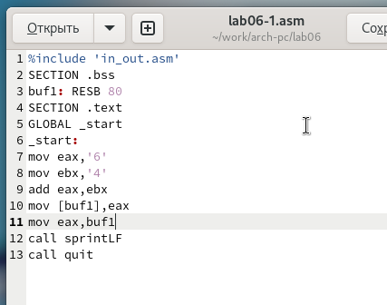
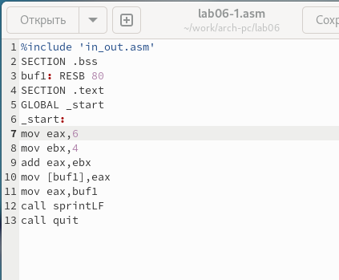
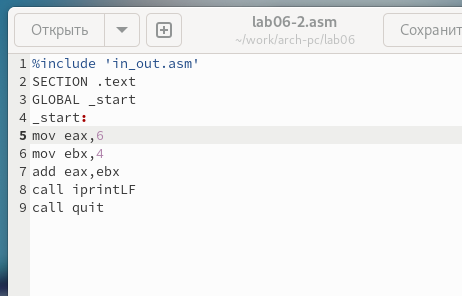
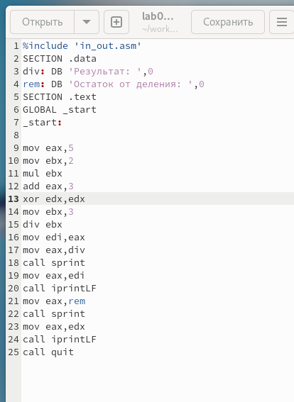
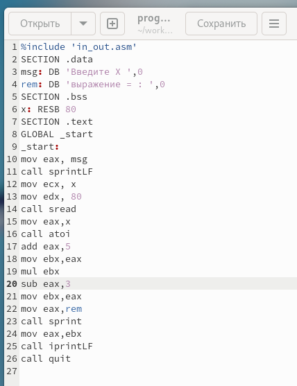

---
## Front matter
title: "Отчёт по лабораторной работе 6"
subtitle: "Архитектура компьютера"
author: "Корпаев Бегдурды НБИ-01-24"

## Generic otions
lang: ru-RU
toc-title: "Содержание"

## Bibliography
bibliography: bib/cite.bib
csl: pandoc/csl/gost-r-7-0-5-2008-numeric.csl

## Pdf output format
toc: true # Table of contents
toc-depth: 2
lof: true # List of figures
lot: true # List of tables
fontsize: 12pt
linestretch: 1.5
papersize: a4
documentclass: scrreprt
## I18n polyglossia
polyglossia-lang:
  name: russian
  options:
	- spelling=modern
	- babelshorthands=true
polyglossia-otherlangs:
  name: english
## I18n babel
babel-lang: russian
babel-otherlangs: english
## Fonts
mainfont: PT Serif
romanfont: PT Serif
sansfont: PT Sans
monofont: PT Mono
mainfontoptions: Ligatures=TeX
romanfontoptions: Ligatures=TeX
sansfontoptions: Ligatures=TeX,Scale=MatchLowercase
monofontoptions: Scale=MatchLowercase,Scale=0.9
## Biblatex
biblatex: true
biblio-style: "gost-numeric"
biblatexoptions:
  - parentracker=true
  - backend=biber
  - hyperref=auto
  - language=auto
  - autolang=other*
  - citestyle=gost-numeric
## Pandoc-crossref LaTeX customization
figureTitle: "Рис."
tableTitle: "Таблица"
listingTitle: "Листинг"
lofTitle: "Список иллюстраций"
lotTitle: "Список таблиц"
lolTitle: "Листинги"
## Misc options
indent: true
header-includes:
  - \usepackage{indentfirst}
  - \usepackage{float} # keep figures where there are in the text
  - \floatplacement{figure}{H} # keep figures where there are in the text
---

# Цель работы

Целью работы является освоение арифметических инструкций языка ассемблера NASM.

# Выполнение лабораторной работы

Я создал папку для хранения файлов шестой лабораторной работы, перешел в нее и сформировал файл с исходным кодом lab6-1.asm.

В ходе этой лабораторной мы изучим примеры программ, демонстрирующих вывод символов и цифровых данных на экран. Эти программы будут оперировать данными, помещенными в регистр eax.

В одной из программ мы помещаем символ '6' в регистр eax с помощью инструкции (mov eax, '6') и символ '4' в регистр ebx (mov ebx, '4'). После этого выполняем сложение значений, находящихся в регистрах eax и ebx (add eax, ebx), и отображаем полученный итог.

Чтобы воспользоваться функцией sprintLF, которая ожидает адрес в регистре eax, мы применяем вспомогательную переменную. Сначала мы копируем содержимое регистра eax в переменную buf1 (mov [buf1], eax), затем загружаем адрес buf1 обратно в регистр eax (mov eax, buf1) и выполняем вызов функции sprintLF.

{ #fig:001 width=70%, height=70% }

{ #fig:002 width=70%, height=70% }

В этом примере мы ожидаем на выходе число 10 после сложения значений регистров eax и ebx. Тем не менее, на экране появится символ 'j', так как двоичный код символа '6' равен 00110110 (что соответствует 54 в десятичной системе), а символа '4' – 00110100 (или 52 в десятичной системе). Инструкция add eax, ebx приводит к записи в регистр eax суммы этих кодов – 01101010 (или 106 в десятичной системе), что соответствует коду символа 'j'.

После этого я внес изменения в код программы, заменив символы на числовые значения в регистрах.

{ #fig:003 width=70%, height=70% }

{ #fig:004 width=70%, height=70% }

Так же, как и в прошлый раз, при запуске программы мы не увидим число 10. 
Вместо этого пройдет вывод символа, который соответствует коду 10. Этот символ представляет собой перевод строки (или возврат каретки). 
На экране консоли он невидим, но создает пустую строку.

В файле in_out.asm внедрены вспомогательные процедуры для преобразования ASCII-символов в числовые значения и наоборот. Я внес изменения в код программы, применив эти процедуры.

{ #fig:005 width=70%, height=70% }

{ #fig:006 width=70%, height=70% }

После запуска программы на экран будет выведено число 106. 
В этом случае, подобно первому примеру, команда add суммирует численные значения символов 
'6' и '4' (54+52=106). Но в отличие от прошлой версии программы, функция iprintLF позволяет отобразить именно число, а не символ с соответствующим числовым кодом.

Таким же образом, как и в предыдущем случае, мы провели замену символов на их числовые эквиваленты.

{ #fig:007 width=70%, height=70% }

Функция iprintLF предназначена для вывода числовых значений, и в данном контексте она работает с числами, а не с их символьными кодами. 
В результате мы видим на экране число 10.

{ #fig:008 width=70%, height=70% }

Функция iprintLF используется для отображения чисел, и в этой ситуации в качестве операндов выступают числа 
(не их символьные коды), что приводит к выводу числа 10.

Мы произвели замену функции iprintLF на iprint. 
Скомпилировали программу, создали исполняемый файл и запустили его. 
Разница в выводе заключается в отсутствии перевода строки.

{ #fig:009 width=70%, height=70% }

{ #fig:010 width=70%, height=70% }

В рамках изучения выполнения арифметических действий в NASM была рассмотрена программа для расчета арифметической функции $$f(x) = (5 * 2 + 3)/3$$.

{ #fig:011 width=70%, height=70% }

{ #fig:012 width=70%, height=70% }

Затем модифицировал код программы для того, чтобы она могла вычислять функцию. После создания исполняемого файла он провел его тестирование. $$f(x) = (4 * 6 + 2)/5$$. 

{ #fig:013 width=70%, height=70% }

{ #fig:014 width=70%, height=70% }

В качестве другого примера мы рассмотрели программу вычисления варианта задания по номеру студенческого билета.

В этом примере число для выполнения арифметических действий пользователь вводит с клавиатуры. Как было отмечено ранее, ввод осуществляется в виде символов, и для того чтобы арифметические операции в NASM были выполнены правильно, эти символы необходимо преобразовать в числовой формат. Для конвертации можно применить функцию atoi, которая содержится в файле in_out.asm.

{ #fig:015 width=70%, height=70% }

{ #fig:016 width=70%, height=70% }

ответы на вопросы

1. Какие строки листинга отвечают за вывод на экран сообщения ‘Ваш вариант:’?

*Команда mov eax, rem загружает в регистр eax строку с текстом "Ваш вариант:". После этого команда call sprint инициирует процедуру, которая выводит эту строку на экран.*

2. Для чего используется следующие инструкции?

*Команда mov ecx, x копирует значение из регистра ecx в переменную x. Команда mov edx, 80 присваивает регистру edx число 80. Команда call sread запускает процедуру чтения данных из стандартного ввода.*

3. Для чего используется инструкция “call atoi”?

*Команда call atoi конвертирует строку символов в целое число.*

4. Какие строки листинга отвечают за вычисления варианта?

*Команды, выполняющие вычисление варианта, включают: xor edx, edx для обнуления регистра edx, mov ebx, 20 для присвоения регистру ebx числа 20, div ebx для деления значения в аккумуляторе на значение в ebx, и inc edx для увеличения результата в регистре edx на единицу.*

5. В какой регистр записывается остаток от деления при выполнении инструкции “div ebx”?

*Остаток от деления после выполнения команды div ebx записывается в регистр edx.*

6. Для чего используется инструкция “inc edx”?

*Команда inc edx служит для инкремента, то есть увеличения значения в регистре edx на один. Это необходимо для корректного расчета варианта по заданной формуле, где к остатку от деления добавляется единица.*

7. Какие строки листинга отвечают за вывод на экран результата вычислений? 

*Команда mov eax, edx помещает результат вычислений в регистр eax. Затем команда call iprintLF активирует процедуру, которая выводит результат на экран с переводом строки.*

## Задание для самостоятельной работы

Написать программу вычисления выражения y = f(x). Программа должна выводить выражение 
для вычисления, выводить запрос на ввод значения x, 
вычислять заданное выражение в зависимости от введенного x, выводить результат вычислений. 
Вид функции f(x) выбрать из таблицы 6.3 вариантов заданий в соответствии с номером 
полученным при выполнении лабораторной работы.
Создайте исполняемый файл и проверьте его работу для значений x1 и x2 из 6.3.

Вариант 15 - $(5 + x)^2 - 3$  для $x=5, x=1$ 

{ #fig:017 width=70%, height=70% }

при $x=5 f(x) = $

при $x=1 f(x) = $

{ #fig:018 width=70%, height=70% }

Программа считает верно.

# Выводы

Изучили работу с арифметическими операциями.